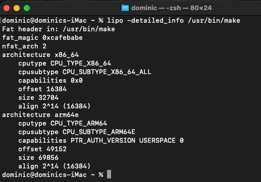

# Understanding macOS Binaries

<figure><figcaption></figcaption></figure>

Unlike windows binaries (`.exe` _and_ `.dll`) Mac OS binaries are usually compiled in [Mach-O format](https://developer.apple.com/library/archive/documentation/Performance/Conceptual/CodeFootprint/Articles/MachOOverview.html) whether its a command-line tool, dynamic library (`.dylib`) or [kernel extension](http://www.macbreaker.com/2012/01/what-are-kexts.html) (`.kext`) they all share the exact same architecture.

### Universal Binaries (Fat Binaries)

With OS X, Apple introduced a concept of Universal binaries which provided a binary format that would be fully portable and could be executed on any architecture(e.g., Intel `x86_64` and Apple Silicon `arm64`). It’s nothing but archive of one or more architecture they support ([fat.h](https://github.com/apple-oss-distributions/xnu/blob/main/EXTERNAL_HEADERS/mach-o/fat.h)). It always starts with a `fat_header`, followed by an array of `fat_arch` structs that tell the loader exactly where the specific Mach-O file for the current CPU resides.

```c
#include <stdint.h>
#include <mach/machine.h>
#include <architecture/byte_order.h>

#define FAT_MAGIC	0xcafebabe
#define FAT_CIGAM	0xbebafeca	/* NXSwapLong(FAT_MAGIC) */

struct fat_header {
	uint32_t	magic;		/* FAT_MAGIC */
	uint32_t	nfat_arch;	/* number of structs that follow */
};

struct fat_arch {
	cpu_type_t	cputype;	/* cpu specifier (int) */
	cpu_subtype_t	cpusubtype;	/* machine specifier (int) */
	uint32_t	offset;		/* file offset to this object file */
	uint32_t	size;		/* size of this object file */
	uint32_t	align;		/* alignment as a power of 2 */
};

#endif /* _MACH_O_FAT_H_ */
```

<figure><figcaption></figcaption></figure>

### Mach-O Architecture

Once the loader has identified the architecture it strips away the **FAT** wrapper to reach the Mach-O format which is composed of **header**, **load commands(L\_SEGMENT\_64)**, and series of segments (**\_\_PAGEZERO, \_\_TEXT, \_\_DATA, \_\_LINKEDIT, etc.**) where each segment has one or more sections containing instructions **(\_text)** or data **(\_data).** Mach-O format begins with a fixed header detailed in ([loader.h](https://github.com/apple-oss-distributions/xnu/blob/main/EXTERNAL_HEADERS/mach-o/loader.h)).

<figure><figcaption></figcaption></figure>

<figure><figcaption></figcaption></figure>

The header begins with a magic value which tells the loader to determine if its intended for 32-bit (`0xfeedface`) or 64-bit arch (`0xfeedfacf`), CPU type and subtype ensure that binary is suitable to be executed on the architecture. 64-bit header contains a extra field _reserved_ and is unused. Because same binary format is used for multiple object types (**executable, library, kexts etc.**), [filetype](https://github.com/apple-oss-distributions/xnu/blob/main/EXTERNAL_HEADERS/mach-o/loader.h#L110) field defines for which object it is used.

```c
/* Constants for the filetype field of the mach_header */
#define	MH_OBJECT	0x1		/* relocatable object file */
#define	MH_EXECUTE	0x2		/* demand paged executable file */
#define	MH_FVMLIB	0x3		/* fixed VM shared library file */
#define	MH_CORE		0x4		/* core file */
#define	MH_PRELOAD	0x5		/* preloaded executable file */
#define	MH_DYLIB	0x6		/* dynamically bound shared library */
#define	MH_DYLINKER	0x7		/* dynamic link editor */
#define	MH_BUNDLE	0x8		/* dynamically bound bundle file */
#define	MH_DYLIB_STUB	0x9		/* shared library stub for static */
					/*  linking only, no section contents */
#define	MH_DSYM		0xa		/* companion file with only debug */
					/*  sections */
#define	MH_KEXT_BUNDLE	0xb		/* x86_64 kexts */
#define	MH_FILESET	0xc		/* set of mach-o's */
```

`ncmds` and `sizeofcmds` used to parse the load commands, it contains instruction which direct how to setup and load the binary when its invoked. Each load command share 2 common fields `cmd` and `cmdsize` , list of load commands is defined in [loader.h](https://github.com/apple-oss-distributions/xnu/blob/main/EXTERNAL_HEADERS/mach-o/loader.h#L253).

```c
struct load_command {
	uint32_t cmd;		/* type of load command */
	uint32_t cmdsize;	/* total size of command in bytes */
};
```

The main load command is `LC_SEGMENT/LC_SEGMENT_64` which tells kernel how to map binary from disk into the virtual memory.

<figure><figcaption></figcaption></figure>

For every segment, memory is loaded from `fileoff` at `vmaddr` , each segment’s page are initialized according to `initprot` which specify page protections `read/write/execute` but cannot exceed the `maxprot` .

Once the memory are being mapped, `LC_UNIXTHREAD/LC_MAIN` command is responsible for starting binary’s main thread (always present in executables not in other binaries), most registers will likely being initialized to zero and Instruction pointer/Program counter holds the address program’s entry point.

* **`__PAGEZERO`:** This segment is used to trap NULL pointer dereferences. It is placed at a near-zero memory address, contains no data, and has zero protection rights (no read, write, or execute). If a program attempts to access it, it immediately crashes.
* **`__TEXT`:** Contains the executable code and read-only data.
* **`__DATA`:** Contains writable data (global variables, etc.).
* **`__LINKEDIT`:** Contains raw data used by the dynamic linker, such as symbol tables, string tables, and relocation entries. To navigate **`__LINKEDIT` ,** Mach-O load commands use 2 specific structures `LC_SYMTAB` and `LC_DYSYMTAB` . `LC_SYMTAB` defines the location and size of symbol table and string table within `__LINKEDIT` by mapping the memory address to human readable strings. `LC_DYSYMTAB` organizes the symbol table in Local symbols, exported symbols and imported symbols, it tells **dyld** which symbols need to be resolved from external libraries at runtime.

These segments have certain flags defined in [loader.h](https://github.com/apple-oss-distributions/xnu/blob/main/EXTERNAL_HEADERS/mach-o/loader.h#L389) and one such flag is `SG_PROTECTED_VERSION_1` means segment pages are protected/encrypted after the first page in segment. It is used by system utils like **Finder** to protect integrity and confidentiality of data.

Next, it has [flags](https://github.com/apple-oss-distributions/xnu/blob/main/EXTERNAL_HEADERS/mach-o/loader.h#L126) field which defines important flags.

<figure><figcaption></figcaption></figure>

Every time a PIE-compiled (Position Independent Executable) Mach-O binary is executed, the macOS kernel generates a random memory offset known as the **ASLR Slide**. The kernel adds this random slide to the base address of the binary, meaning the `__TEXT` and `__DATA` segments are never loaded into the exact same memory locations twice. This security feature prevents attackers from hardcoding memory addresses in exploits.

Once the kernel has mapped segments into memory,it doesn’t immediately run program instead it gives control to dynamic linker(**dyld**) which is responsible for resolving library dependencies and symbols, also provide minimal version of segment, sections. There is a mechanism supported by **dyld** which is shared library cache([dyld\_shared\_cache](https://github.com/opensource-apple/dyld/blob/master/launch-cache/dyld_cache_format.h)), these are the libraries which are prelinked and stored in a single file where most common libraries are cached so it improves the performance. The shared cache is found in `/var/db/dyld/` . Once `dyld` has completely finished setting up the environment and linking libraries, it reads the `LC_MAIN` load command to find the program's actual entry point. Finally, `dyld` jumps to that memory address (your `main()` function), and the application officially begins running.

<figure><figcaption></figcaption></figure>

### References

* XNU Source Code - [https://github.com/apple-oss-distributions/xnu](https://github.com/apple-oss-distributions/xnu)
* Mac OS X and iOS Internals to the apple’s core by Jonathan Levin
* [https://developer.apple.com/](https://developer.apple.com/)
