# WannaCry Analysis(Malware)

### NOTE

With estimates over 100,000 computers impacted globally thus far, many people received unwelcome notes Friday similar to those below demanding a fee to decrypt their files. While the notes promise to return the data, it’s not guaranteed that paying the ransom will return data safely, but if it gets this far and adequate backups are not in place, it may be the only recourse the victim has. No one ever wants to see one of these.

<figure>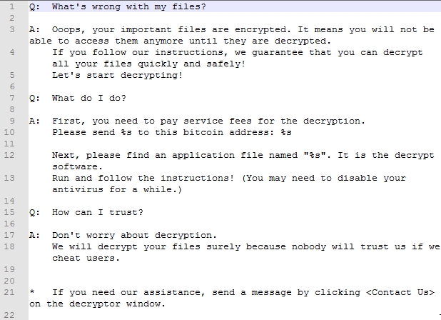<figcaption></figcaption></figure>

_Figure 1: Ransom Note_

### Technical Summary

`SHA256 24d004a104d4d54034dbcffc2a4b19a11f39008a575aa614ea04703480b1022c/ MD5 Db349b97c37d22f5ea1d1841e3c89eb4` from [VirusTotal](https://virustotal.com). It consists of two parts: stage-0 executable and an unpacked stage-2 encryption and worm program. It first attempts to contact its kill switch URL (_hxxps://iuqerfsodp9ifjaposdfjhgosurijfaewrwergwea.com_). If the URL is alive it does not execute. If the URL is not found then the malware unpacks **tasksche.exe** and creates a service to start tasksche.exe on startup. This executable encrypts all the files, and popup ransom window and changes the background of Desktop. It creates a random folder inside C:\ProgramData with some random naming to store all the wannacry files. It exploits the EternalBlue vulnerability on port 445(SMB) to spread to other computers. Initial executable runs and checks if the kill switch url is alive or not. If it is alive then stops the execution and if not it unpacks the persistance binary **tasksche.exe**. **Tasksche.exe** was residing in a randomly named directory inside ProgramData which tries to spread over network using port 445 to infect other computers by encrypting all files and ransom popup window.

### Static Analysis

#### Basic

On running _floss_ on the executable its shows modules used to open a url and service name used, kill switch url, and randomly named path which is likely used to store the unpacked data of ransomware.

<figure>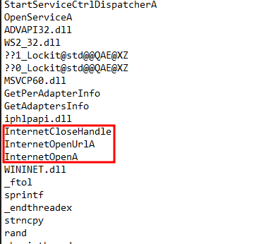<figcaption></figcaption></figure>

_Figure 2: Network Modules_

<figure>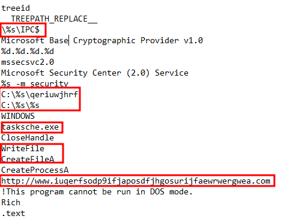<figcaption></figcaption></figure>

_Figure 3: Service name, kill switch url, random path_

Then it shows commands used, `icacls` used to modify the access control of files and `attrib +h .` used to hide the file attributes and a string `WNcry@2ol7` which look like a password.

<figure>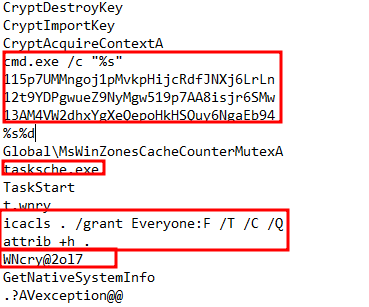<figcaption></figcaption></figure>

_Figure 4: commands, modifying access control, hiding file attrib, password_

Here is list of all imports which include certain socket, Read/write file, and many other modules utilised by this executable.

<figure>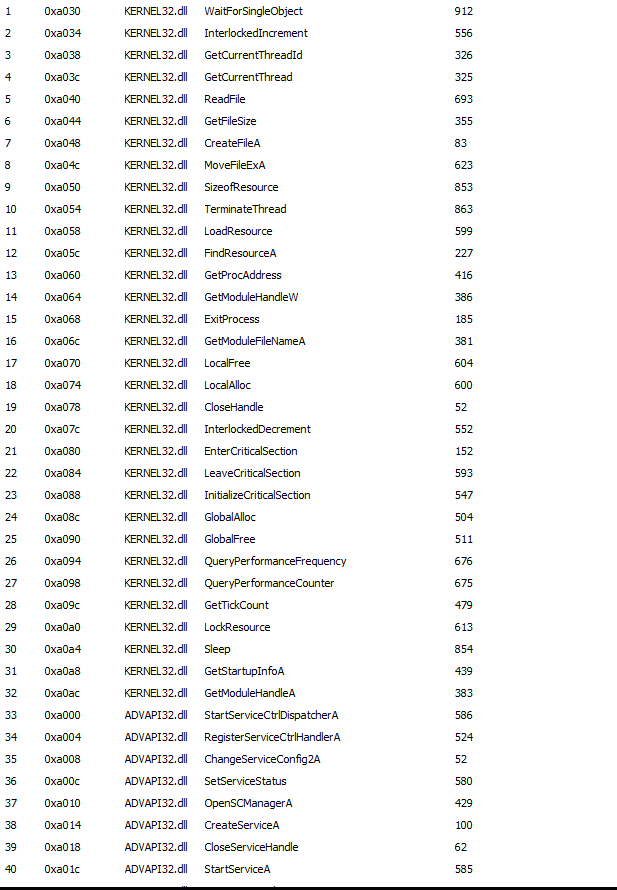<figcaption></figcaption></figure>

_Figure 5: Import\_1_

<figure>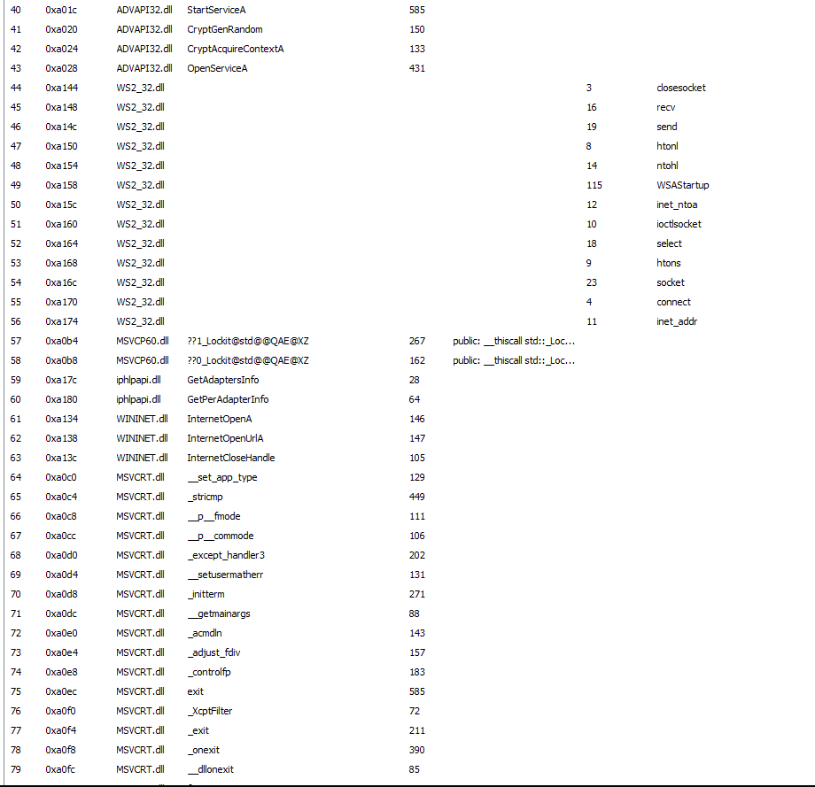<figcaption></figcaption></figure>

_Figure 6: Import\_2_

<figure>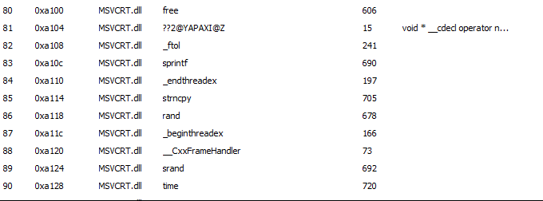<figcaption></figcaption></figure>

_Figure 7: Import\_3_

<figure>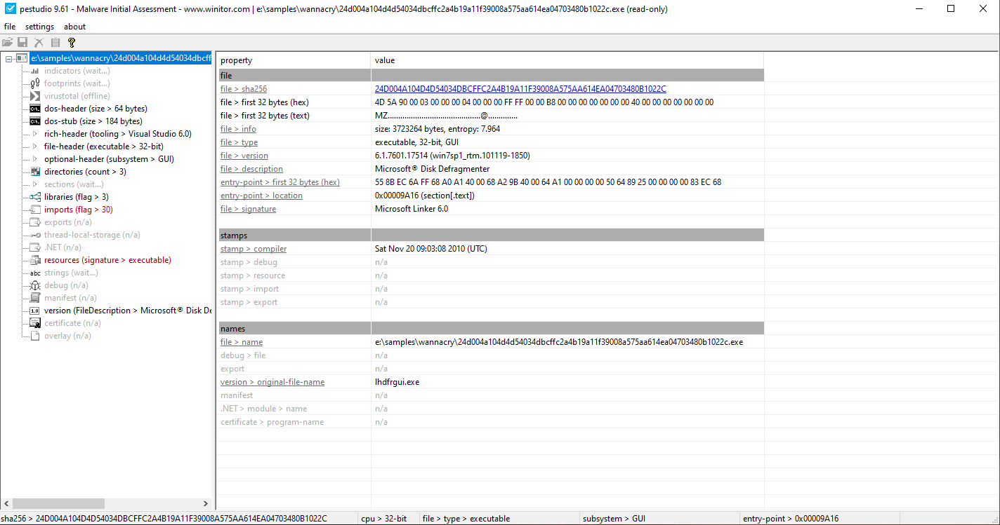<figcaption></figcaption></figure>

_Figure 8: Information from pestudio_

#### Advanced

On viewing the assembly code in _IDA_ it shows that the binary first tries to connect with the kill switch url if that returned anything other than zero it means the url is active and working so binary stops its execution there otherwise calls a function `sub_408090`.

<figure>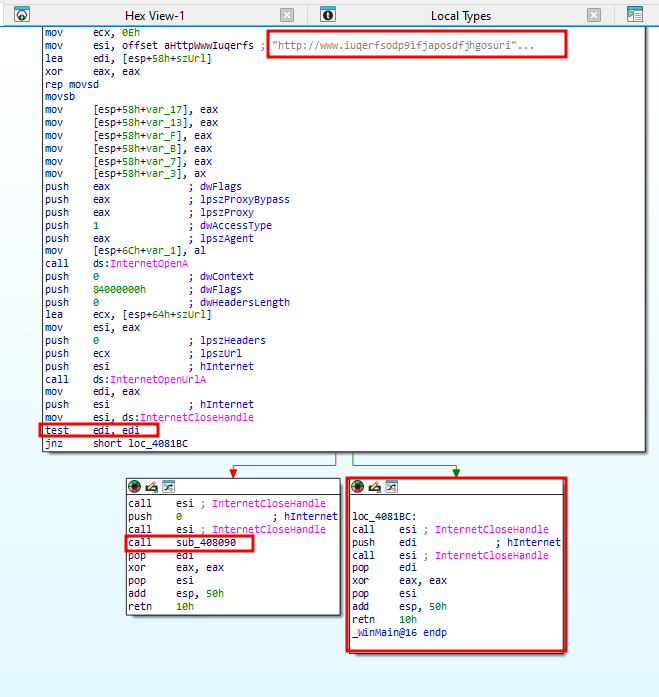<figcaption></figcaption></figure>

_Figure 9: Assembly code in IDA_

### Dynamic Analysis

With [fakenet](https://github.com/mandiant/flare-fakenet-ng) running and wireshark opened when i executed the binary, it made a **DNS** query to url _www.iuqerfsodp9ifjaposdfjhgosurijfaewrwergwea.com_ to check if its alive or not.

<figure>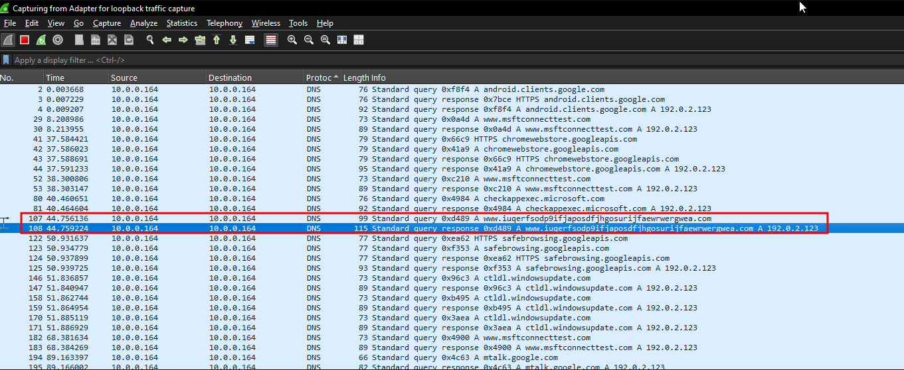<figcaption></figcaption></figure>

_Figure 10: DNS Query to kill switch_

It created a random directory named `dyxbnfbi618` in ProgramData which is staging area of rasomware files and start encrypting all the files in the system.&#x20;

<figure>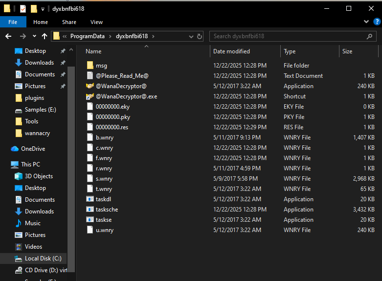<figcaption></figcaption></figure>

_Figure 11: Staging area of ransomware files_

<figure>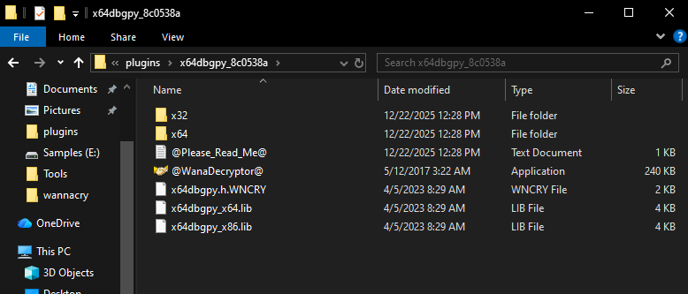<figcaption></figcaption></figure>

_Figure 12: Encrypts every file_

Using **tasksche.exe** it creates a service named same as the random directory which invokes tasksche.exe on startup.

<figure>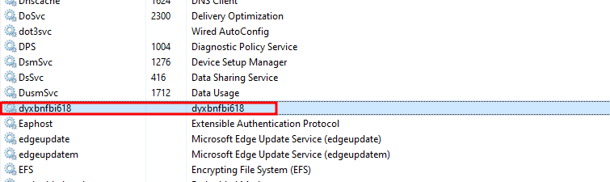<figcaption></figcaption></figure>

_Figure 13: Service named randomly_

<figure>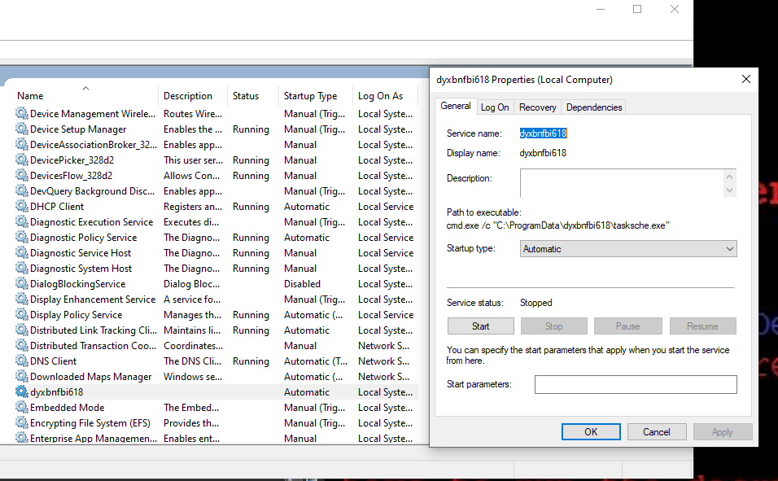<figcaption></figcaption></figure>

_Figure 14: Service Properties_

After infection it changes the background, encryptes all old files and popup a ransom payment window.

<figure>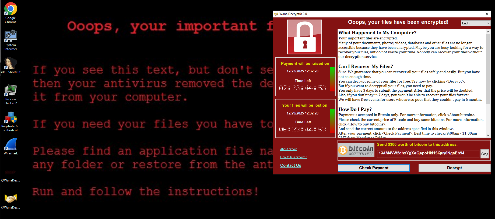<figcaption></figcaption></figure>

_Figure 15: Ransom Window_

### IOCs

<figure><figcaption></figcaption></figure>

_Figure 16: Connection to kill switch url_

<figure>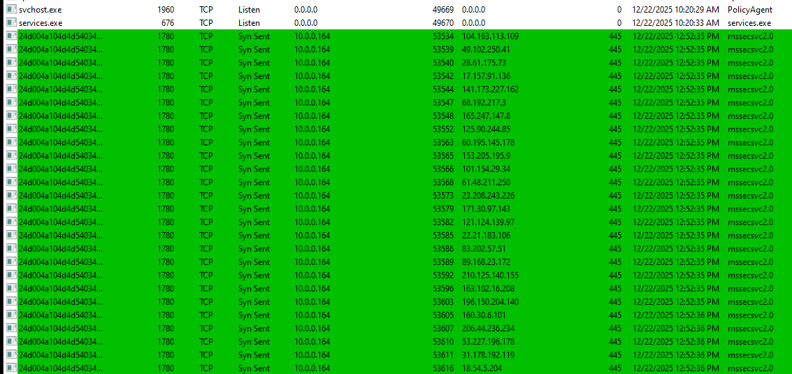<figcaption></figcaption></figure>

_Figure 17: Locating other machine and exploiting with port 445_

### Rules and Signatures

```yara
rule Ransomware_WannaCry {
	meta:
		last_updated = "2025-12-18"
		author = "0xSec"
		description = "Yara Rule for WannaCry Ransomware"

	strings:
		$string1 = "attrib +h ." fullword ascii
		$cmd = "icacls . /grant Everyone:F /T /C /Q" fullword ascii
		$string3 = "C:\\%s\\dyxbnfbi618" fullword ascii
		$passwd = "WNcry@2ol7" fullword ascii
		$ext = "wnry" ascii
		$ext1 = "WNCRY" ascii
		$kill_switch = "www.iuqerfsodp9ifjaposdfjhgosurijfaewrwergwea.com" ascii
		$payload = "tasksche.exe" ascii
		$PE_magic_byte = "MZ"

	condition:
		$PE_magic_byte at 0 and
		($url or 1 of ($string*) or $payload)
}
```
