# NanoCore RAT Analysis

### Background

Nanocore is a [Remote Access Tool](https://www.malwarebytes.com/blog/threats/remote-access-trojan-rat) used to steal credentials and to spy on cameras. It as been used for a while by numerous criminal actors as well as by nation state threat actors e.g. [The Gorgon Group](https://malpedia.caad.fkie.fraunhofer.de/actor/the_gorgon_group), [APT33](https://malpedia.caad.fkie.fraunhofer.de/actor/apt33).

SAMPLE - `sha256 da551ab6e000732499227a67f2be68d1256b58d95963a903cc316e2730db9d1e`

### Static Analysis - Stage 1

On analyzing the hash in [virustotal](https://www.virustotal.com) I found out that it was marked malicious by `54` vendors and in malware bazaar it was detected by `19` vendors as of now. And its a multi stage malware further revealing configs of malware and its key details.

<figure>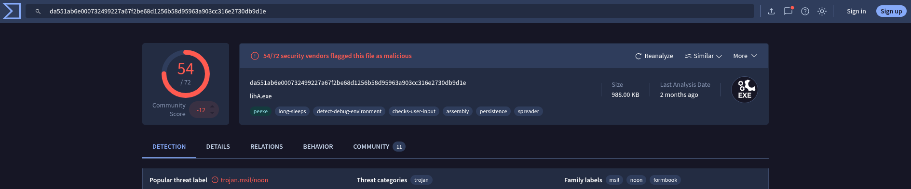<figcaption></figcaption></figure>

<p align="center"><em>Figure 1: Virustotal</em></p>

<figure>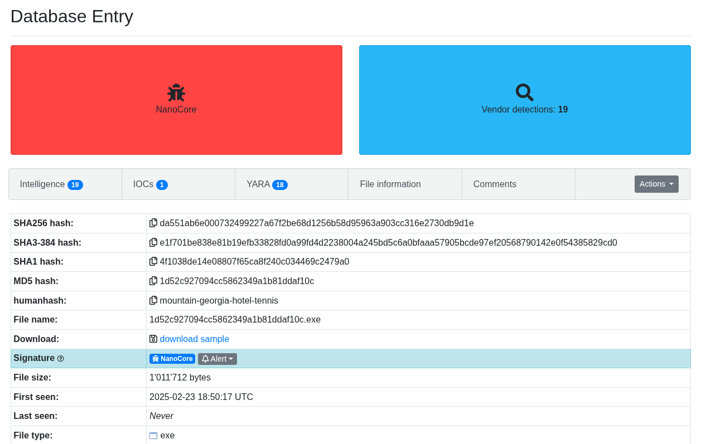<figcaption></figcaption></figure>

<p align="center"><em>Figure 2: Malware Bazaar</em></p>

At first, I used [DIE](https://github.com/horsicq/Detect-It-Easy) to gather information of binary and it showed that initial binary was packed and is using `C#` and `.NET`.

<figure>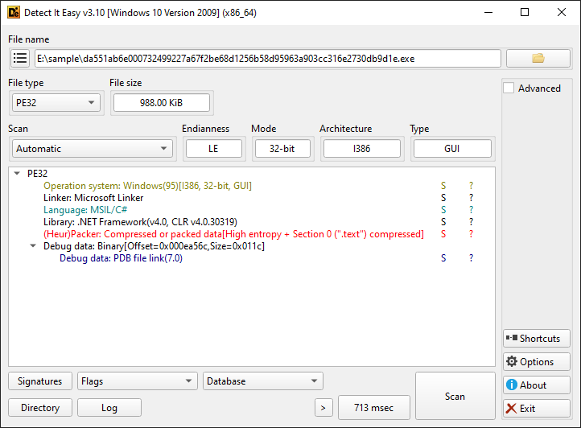<figcaption></figcaption></figure>

<p align="center"><em>Figure 3: Detect It Easy</em></p>

After that I analyzed the binary with [CAPA](https://github.com/mandiant/capa) which gave me hint of presence of anti analysis techniques and that this binary is only initial stage.

<figure>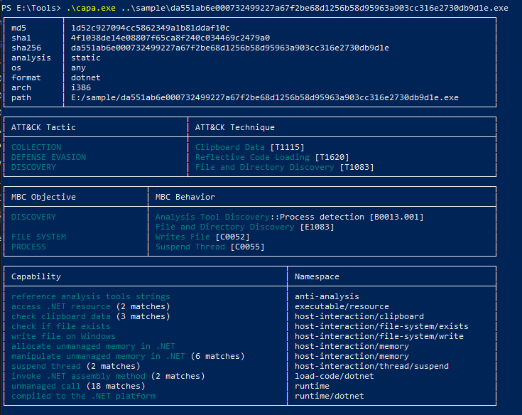<figcaption></figcaption></figure>

<p align="center"><em>Figure 4: CAPA hints anti analysis techniques</em></p>

Since this malware includes anti-debugging techniques, which makes it challenging to extract next stage malware so I have to take dynamic approach for this.

### Dynamic Analysis - Stage 1

I will be using [pe-sieve](https://github.com/hasherezade/pe-sieve) to see any malicious implants by the stage 1 binary. After running it i got 2 files which are malicious and it dumped a `dll` and a `exe` file which was likely stage 2 malware.

<figure>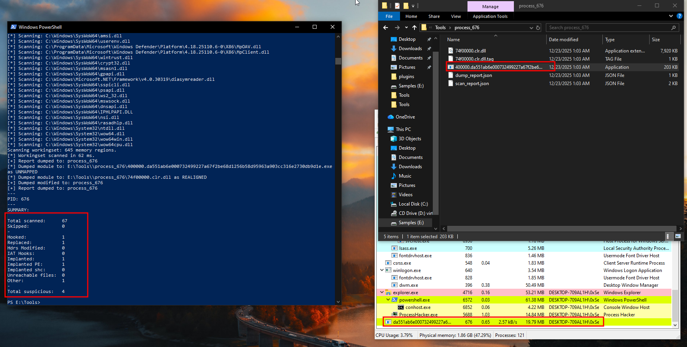<figcaption></figcaption></figure>

<p align="center"><em>Figure 5: Extracting stage 2 malware dynamically</em></p>

### Static Analysis - Stage 2

Now analyzing stage 2 PE binary with DIE, CAPA, like tools. With DIE, it showed that this binary is written in .NET and is protected by [Eazfuscator](https://www.gapotchenko.com/eazfuscator.net) which is used to obfuscate .NET code to prevent reverse engineering and analysis.

<figure>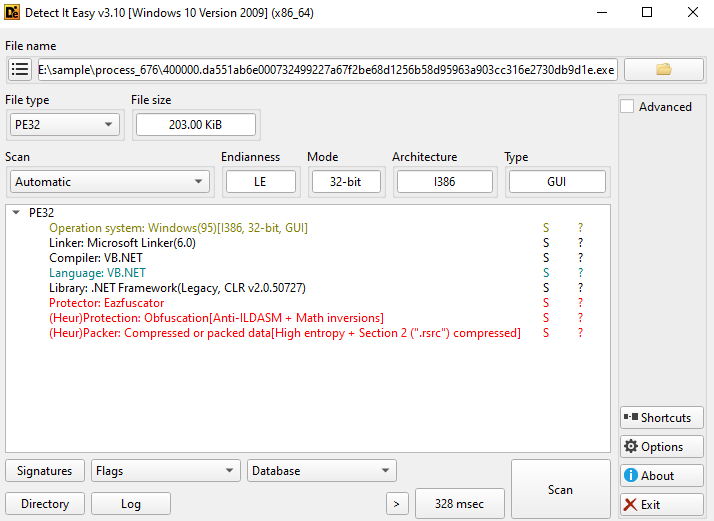<figcaption></figcaption></figure>

<p align="center"><em>Figure 6: Analyzing stage 2 malware</em></p>

CAPA's output gave more detail about the binary including its behaviour and techniques like Command and Control, DNS Communication etc.

<figure>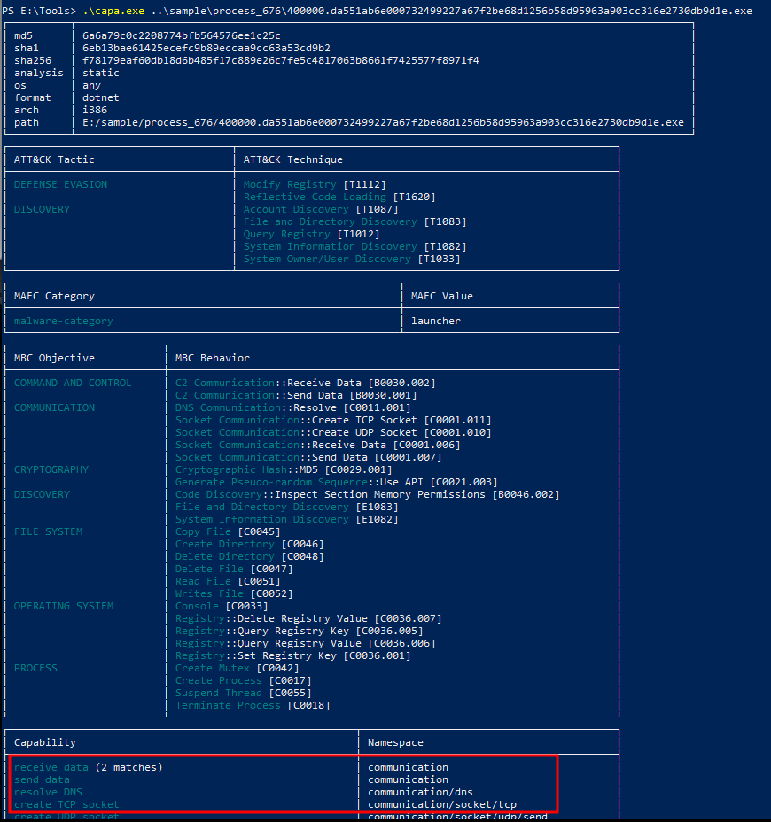<figcaption></figcaption></figure>

<p align="center"><em>Figure 7: Technique and Behaviour of stage 2 malware</em></p>

<figure><figcaption></figcaption></figure>

<p align="center"><em>Figure 8: PEStudio output of stage 2 malware</em></p>

After this i loaded the binary into [dnSpy](https://github.com/dnSpy/dnSpy) a decompiler for .NET binaries which lets me analyze the binary more deeply and i found the entry point of program in `ClientLoaderForm`.

<figure>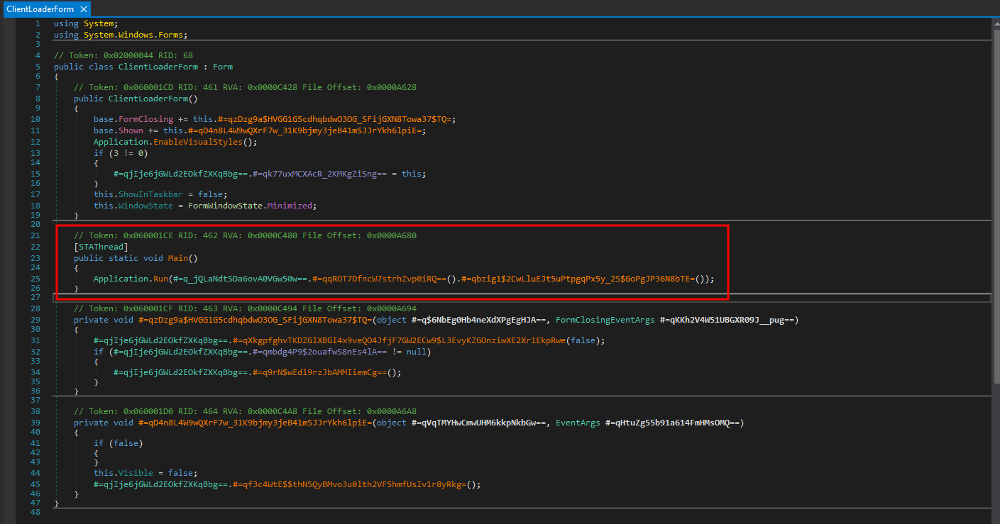<figcaption></figcaption></figure>

<p align="center"><em>Figure 9: Entry Point of program</em></p>

After a lot of debugging I finally managed to get the malware configurations including C2 host, port, run on startup, [mutex](https://www.reddit.com/r/Malware/comments/j7u9g0/mutex/) etc.

<figure>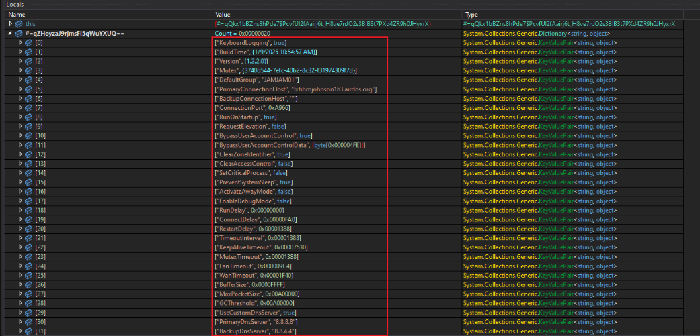<figcaption></figcaption></figure>

<p align="center"><em>Figure 10: Malware Configuration</em></p>

### Dynamic Analysis - Stage 2

After running the malware it tried to establish a connection to a remote address `192.0.2.123` via port `43366` which is the typical behaviour of a RAT. In the network section we can see that it also makes a DNS query to domain `lxtihmjohnson163.airdns.org`.

<figure>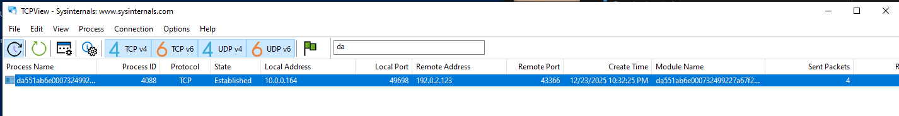<figcaption></figcaption></figure>

<p align="center"><em>Figure 11: Connection to a remote address</em></p>

<figure>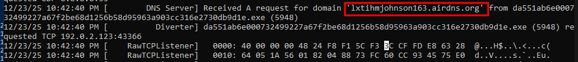<figcaption></figcaption></figure>

<p align="center"><em>Figure 12: DNS query to C2 domain</em></p>

After the system restarts the malware executes with a different name and location using name `ddpss.exe` to impersonate as a legitimate process as company name is `Melvin Fengels`.

<figure>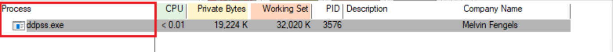<figcaption></figcaption></figure>

<p align="center"><em>Figure 13: After restart it executes as legitimate name</em></p>

and it can be seen also in registry using Autorun that it was added on Logon i.e. whenever system restarts it executes the malware under name `DDP System`.

<figure>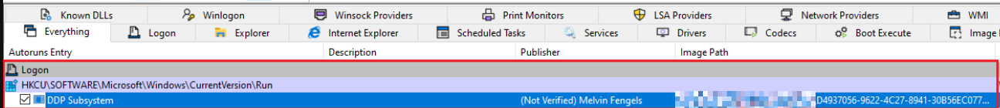<figcaption></figcaption></figure>

<p align="center"><em>Figure 14: New registry under Logon</em></p>

### IOCs

Hashes

```
da551ab6e000732499227a67f2be68d1256b58d95963a903cc316e2730db9d1e -> Stage 1
f78179eaf60db18d6b485f17c889e26c7fe5c4817063b8661f7425577f8971f4 -> Stage 2
```

Domains `lxtihmjohnson163.airdns.org`

IP `192.0.2.123`
