# AndroRAT Android Malware Analysis

### Overview

Androrat is a remote administration tool developed in Java Android for the client side and in Java/Swing for the Server. The name Androrat is a mix of Android and RAT (Remote Access Tool). It has been developed in a team of 4 for a university project. The goal of the application is to give the control of the android system remotely and retrieve informations from it.

SAMPLE - `c5ab0adaedf391a395387df33b0bf6854f1ccc9c5da937915ea86b5eec6e6103`

### Static Analysis

After extracting zip I directly jumped for analysis and while examining decompiled apk, I saw that malware isn't obfuscated which made work easy. So, I started my analysis from `AndroidManifest.xml` because its where permissions are declared and there i saw some permissions like `READ/WRITE_EXTERNAL_STORAGE, READ_SMS, RECORD_AUDIO, READ_CALL_LOG, ACCESS_FINE_LOCATION` and one major thing that caught my attention was permission for `CAMERA` and certain other like `jobScheduler` and a code `1337` something `SECRET_CODE` that the malware listens.

<figure>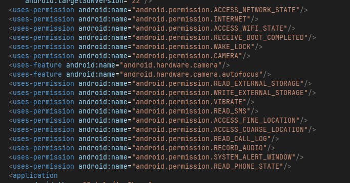<figcaption></figcaption></figure>

<em>Figure 1: Dangerous Permissions</em>

<figure>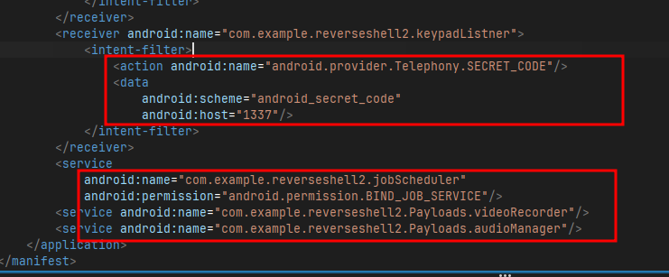<figcaption></figcaption></figure>

<em>Figure 2: SECRET_CODE and Job Scheduling</em>

<figure>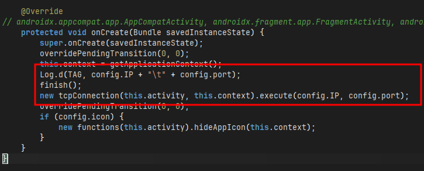<figcaption></figcaption></figure>

<em>Figure 3: Creates a TCP connection to C2 server</em>

In the `config` of the apk there is initilization of IP and PORT like `192.169.x.x` and `8000` now coming to `MainActivity` it makes a TCP connection to the C2 server when `onCreate` is executed.

<figure><figcaption></figcaption></figure>

<em>Figure 4: Initilize shell, audio/video manager</em>

Tracing the `tcpConnection` it shows how this malware works, there are initilization of `shell, IPAddr, audioManager, videoRecorder, so on` lets analyze them one by one. First, `ipAddr` it has two functions `getMACAddress` which return a MAC address and `getIPAdress` which return a IP, we will see it in upcoming code.

<figure>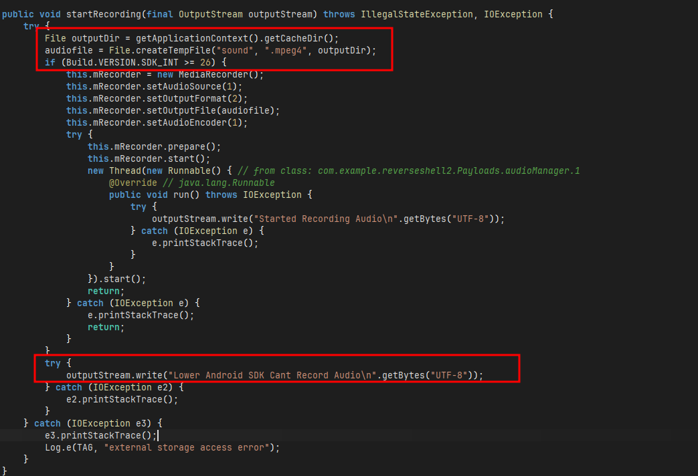<figcaption></figcaption></figure>

<em>Figure 5: Recording audio and storing in cache dir</em>

<figure>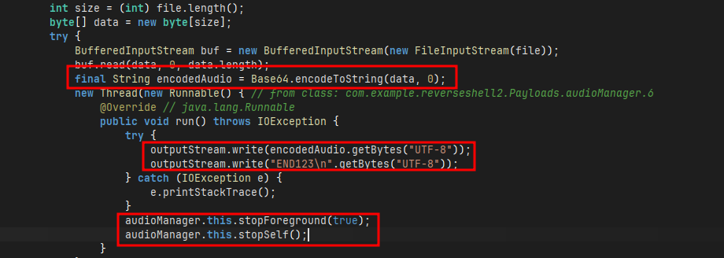<figcaption></figcaption></figure>

<em>Figure 6: Encodes audio in base64 and attach END123 marker</em>

Now, in `audioManager` there are function responsible for recording audio and saving it. One of the function `startRecording` which records audio only if the `BUILD.VERSION` is greater than or equal 26 otherwise `Lower Android SDK Cant Record Audio` and it records audio in `.mpeg4` format and stores in **cache** directory. When `stopRecording` is called it converts the audio data into **base64** for transmission and write `END123` at end of it, it act as marker that server look for and once transmission is completed it stops `audioManager`. `videoRecorder` utlizes similar approach to record video in `.mp4` and rest is similar.

<figure>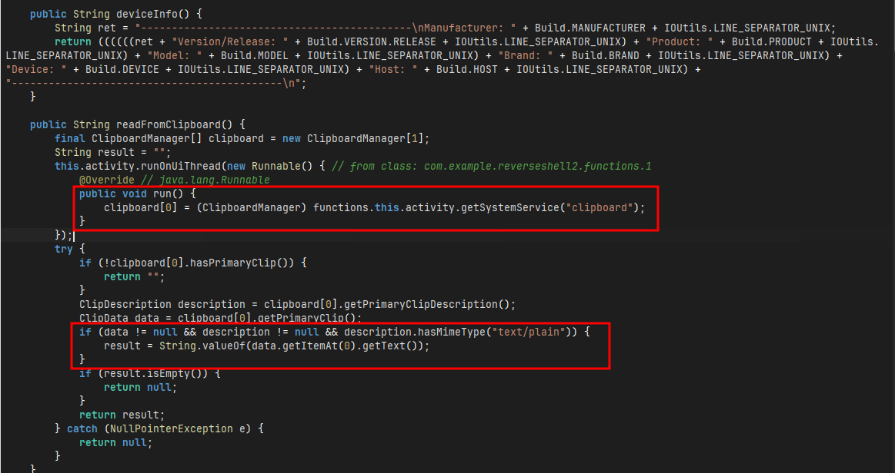<figcaption></figcaption></figure>

<em>Figure 7: Extracts critical infomartions</em>

<figure>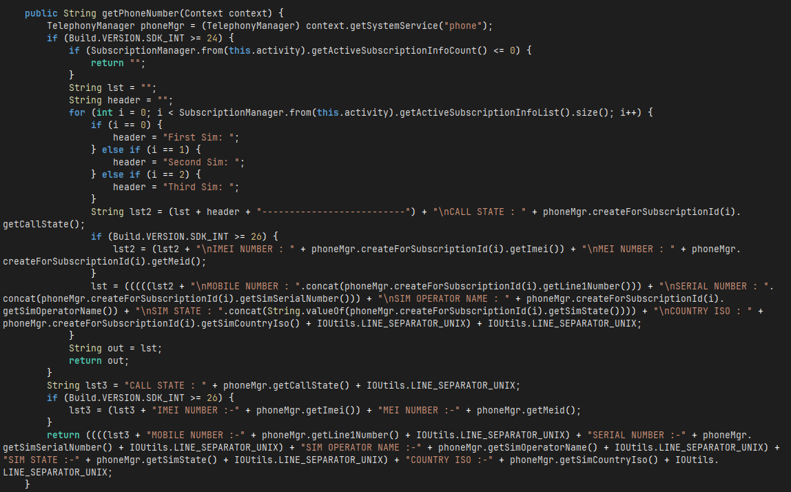<figcaption></figcaption></figure>

<em>Figure 8: Extracts phone number</em>

Now there is a function `functions` which extracts all the information about the phone including `Model, IMEI, Phone Number of each sim, Brand, Manufacturer, so on` also there is a function `readFromClipboard` which reads the content of clipboard of user that might get to info like **passowrds, OTP**. A `jobScheduler` function to schedule the malware to start automatically.

<figure>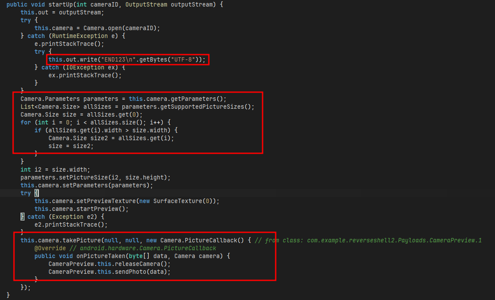<figcaption></figcaption></figure>

<em>Figure 9: Clicks photo using phone's camera</em>

Afterwards, there is `cameraPreview` function which click photo and sends to server using same encoding on **jpeg** image and attaching `END123` marker to it.

<figure>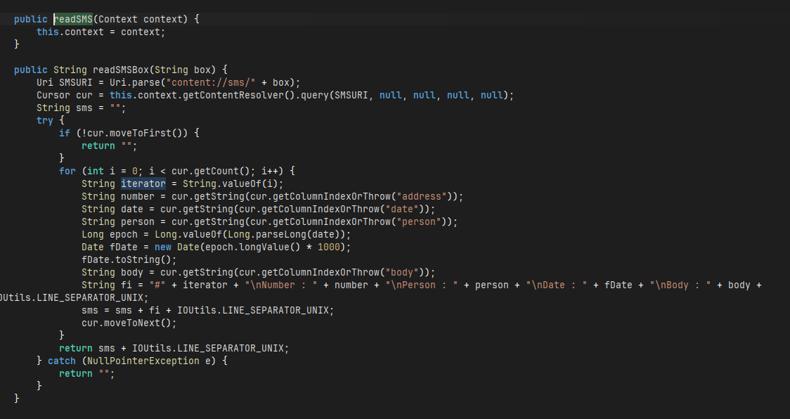<figcaption></figcaption></figure>

<em>Figure 10: Reads messages</em>

Now `readSMS` reads all the messages from **Android system SMS databse** including Bank OTP, and other confidential information. And with `locationManager` it points out the exact latitude and logitude of user using gps and netowrk location. Using `readCallLogs` it reads all the call history of the user including whom user talked to, duration of call, date of it and phone number of other user by reading `content://call_log/calls` system call log database.

<figure>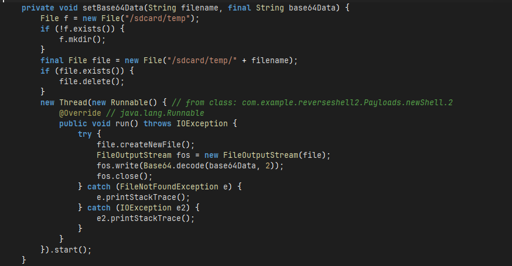<figcaption></figcaption></figure>

<em>Figure 11: Sends encoded data to C2 server</em>

Now `newShell` is responsible for sending all the encoded data including messages, clipboard, call\_logs from `/sdcard/temp` to the C2 server. Coming back to `tcpConnection` there is a function `doInBackground` which keeps the connection between server and victim and in in case phone got disconncted from newtork, it won't stop it will keep trying indefinitely unless gets the connection back. When the server gots the connection it will show a message to server `Hello there, welcome to reverse shell of XXXX` with model specific.

<figure>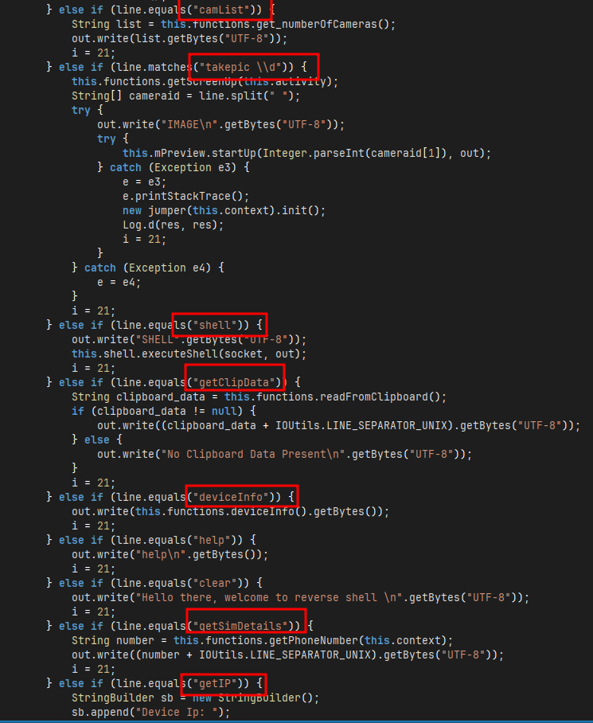<figcaption></figcaption></figure>

<em>Figure 12: Commands attacker can send to victim</em>

Then a infinite loop starts which will keeps asking of inputs but exits when a **null** is provided, it has commands such as `camList, takepic \\d, shell, getClipData, deviceInfo, getIP, getSimDetails, getSMS, vibrate, getLocation, start/stop audio/video, getCallLogs` which will provided each confidential information to the attacker and the most critical command was **shell** through which the attacker can even get a shell to victim's device.

### Dynamic Analysis

For dynamic analysis, since the ip which was given is a private dummy ip so I changed that IP to my laptop's IP so that i can test it. I have rebuild and signed the apk again with my configuration for testing. After i installed and open app in my spare phone i got a call back from my device.

<figure>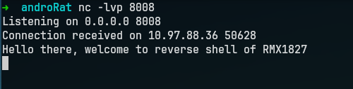<figcaption></figcaption></figure>

<em>Figure 13: Call back from android device</em>

Also tried the above found commands and everything is working as it was intended.

<figure>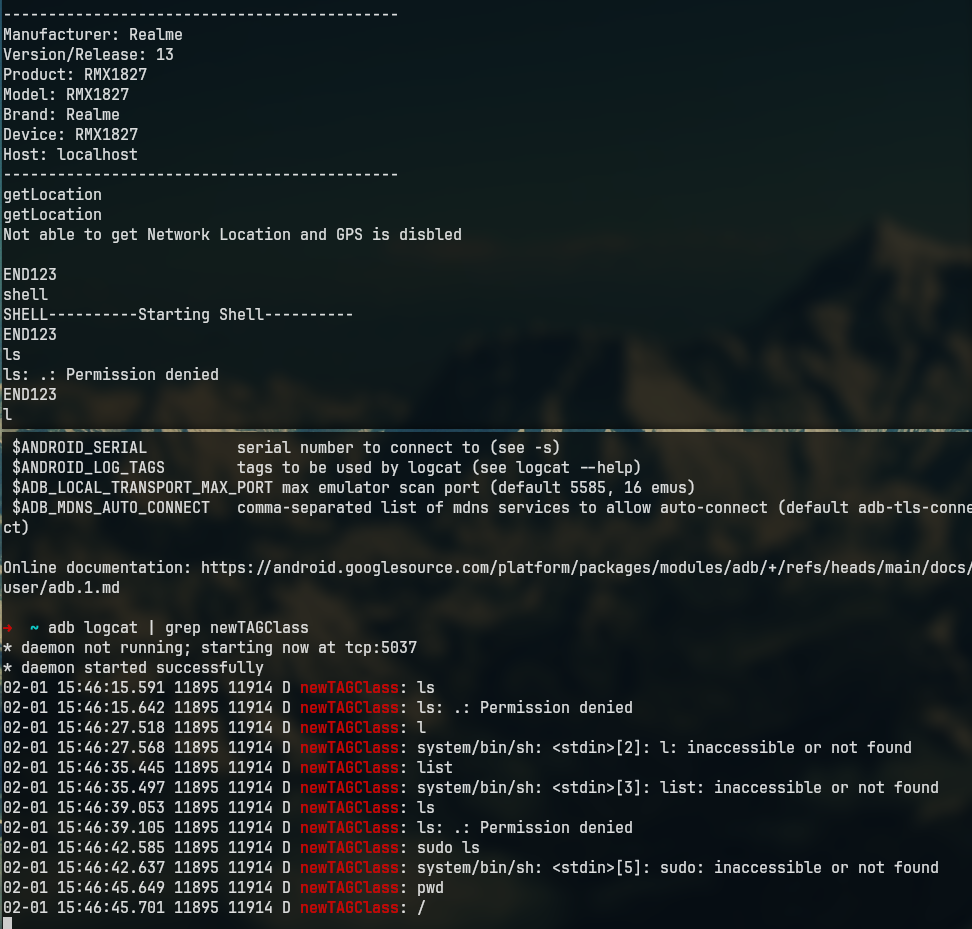<figcaption></figcaption></figure>

<em>Figure 14: Working commands</em>

### IOCs

* IP - `192.168.x.x`
* PORT - `8000`
* C2 COMMANDS - `getLocation, deviceInfo, shell, camList, getClipData`
